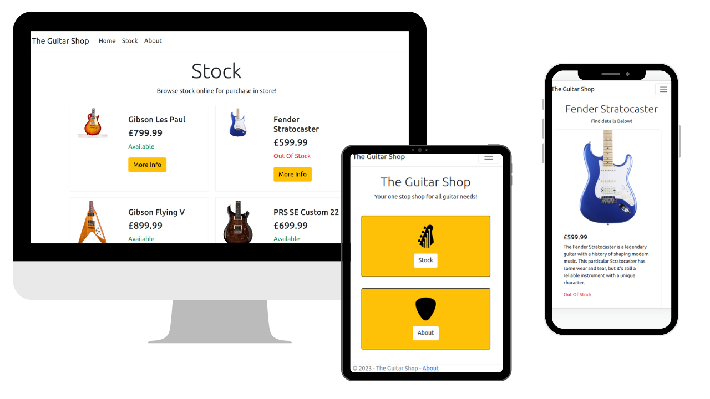

# The Guitar Shop

A simple guitar shop website built to practise my C#, ASP.NET and Bootstrap CSS skills! Browse guitars, learn more about each and navigate seamlessly between dynamically rendered pages and urls.

## Screenshots




## Prerequisites

Before you begin, ensure you have met the following requirements:

- **Development Environment:** You should have a development environment set up for .NET development, including Visual Studio or Visual Studio Code.

- **Dependencies:** Make sure you have the necessary dependencies installed, including .NET Core SDK and ASP.NET.


## Installation

Follow these steps to set up and run the Guitar Shop Website:


 1. Clone the GitHub repository:

   ```
  git clone https://github.com/DanielCouperthwaite/number-blast.git
   ```

  2. Navigate to the project directory:
    
  ```
  cd guitar-shop
  ```

  3. Start the development server:
    
  ```
  dotnet run
  ```

  Open your web browser and visit the displayed local host link to host the site locally.


## Author

Thanks for dropping by! You can find out more about me in the links below, or find information about my other hosted projects!
    
- Daniel Couperthwaite
- Portfolio: [danielcouperthwaite.tech](https://danielcouperthwaite.tech/)
- LinkedIn: [Daniel Couperthwaite](https://www.linkedin.com/in/daniel-couperthwaite-209290139/)